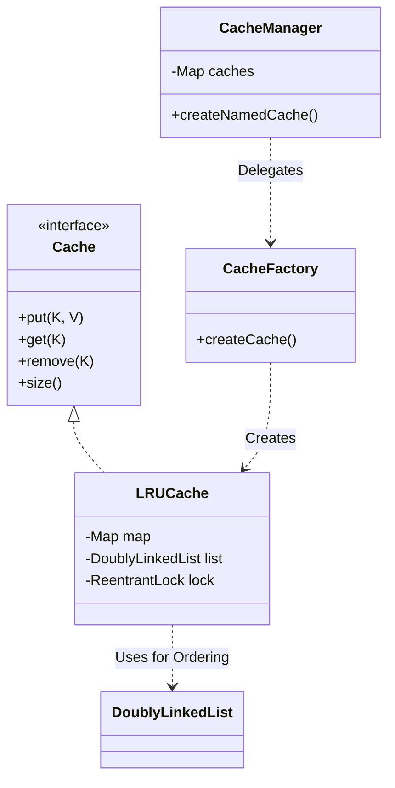

# High-Performance LRU Cache (Java)


A thread-safe, generic, and extensible implementation of a **Least Recently Used (LRU) Cache** in Java. This project demonstrates low-level system design concepts, strictly adhering to **SOLID principles** and standard **Design Patterns**.

---

## 📖 Table of Contents
- [Key Features](#-key-features)
- [System Design](#-system-design)
- [Project Structure](#-project-structure)
- [Getting Started](#-getting-started)
- [Usage](#-usage)
- [Testing](#-testing)

---

## 🚀 Key Features

- **$O(1)$ Performance:** Constant time complexity for `get`, `put`, and `remove` operations.
- **Thread Safety:** Fully concurrent implementation using `ReentrantLock` (optimistic locking strategy).
- **Type Safety:** Generic implementation (`Cache<K, V>`) supporting any object types.
- **Extensible Architecture:** Built using **Factory** and **Strategy** patterns to easily support future eviction policies (FIFO, LFU) without modifying core logic.
- **Robustness:** Comprehensive error handling with custom `CacheException`.

---

## 📐 System Design

### Architecture
The design separates **storage mechanics** from **eviction policy** and **orchestration**.



### Design Patterns & Principles
- **Single Responsibility (SRP):** `LRUCache` handles orchestration, `DoublyLinkedList` handles ordering, `CacheFactory` handles creation.
- **Dependency Inversion (DIP):** The `CacheManager` depends on the `Cache` interface, not the concrete `LRUCache`.
- **Open/Closed (OCP):** New eviction policies can be added to `EvictionPolicy` and handled in the Factory without touching the storage logic.

---

## 📂 Project Structure

```text
src
├── main
│   └── java
│       └── com
│           └── lrucache
│               ├── Cache.java                // API Interface
│               ├── LRUCache.java             // Concrete Implementation
│               ├── EvictionPolicy.java       // Strategy Enum
│               ├── CacheFactory.java         // Factory Pattern
│               ├── CacheManager.java         // Manager for multiple caches
│               ├── CacheEntry.java           // Internal Node (Package-private)
│               ├── DoublyLinkedList.java     // Internal Ordering (Package-private)
│               └── exceptions
│                   └── CacheException.java   // Custom Exception
└── test
    └── java
        └── com
            └── lrucache
                └── LRUCacheTest.java         // JUnit 5 Tests
```

---

## 🛠 Getting Started

### Prerequisites
- Java 11 or higher
- Maven 3.6+

### Installation
Clone the repository and build the project:

```bash
mvn clean install
```

---

## 💻 Usage

### 1. Basic Usage (Factory)
The simplest way to use the cache is via the `CacheFactory`.

```java
import com.lrucache.*;

public class App {
    public static void main(String[] args) throws Exception {
        // Create a cache with capacity 3
        Cache<String, String> cache = CacheFactory.createCache(EvictionPolicy.LRU, 3);

        cache.put("user:1", "Alice");
        cache.put("user:2", "Bob");
        cache.put("user:3", "Charlie");

        // Access Alice (Move to Head/MRU)
        cache.get("user:1"); 
        
        // Add Dave (Evicts Bob, as he is now LRU)
        cache.put("user:4", "Dave");
    }
}
```

### 2. Using CacheManager
For applications requiring multiple named caches (e.g., one for users, one for products).

```java
CacheManager manager = new CacheManager();

// Create isolated caches
Cache<Integer, String> userCache = manager.createNamedCache("users", EvictionPolicy.LRU, 100);
Cache<String, Double> priceCache = manager.createNamedCache("prices", EvictionPolicy.LRU, 50);

// Retrieve existing cache
Cache<Integer, String> myCache = (Cache<Integer, String>) manager.getCache("users");
```

---

## 🧪 Testing

The project uses **JUnit 5**. To run the full test suite:

```bash
mvn test
```

**Test Coverage:**
- Basic Put/Get operations.
- Eviction logic (Capacity overflow).
- Updating existing keys (MRU refresh).
- Cache clearing and removal.
- Concurrency checks (implicit via lock usage).
